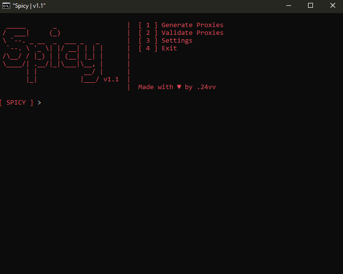

# Spicy

Spicy is a simple proxy generator & validator utilizing the [Proxyscrape API](https://docs.proxyscrape.com/)!

## Features

- **Proxy Generation**: Allows users to generate a specified number of proxies using the ``generate_proxies`` function.

- **Proxy Validation**: Allows users to validate individual proxies or validate all proxies stored in the ``output.txt`` file.

- **Auto Store**: Utilizes an option to automatically store the generated proxies in a file. ``(output/output.txt)``

- **Auto Deletion**: Automatically removes invalid proxies from the ``output.txt`` file after validation.

- **User Friendly Interface**: An easy to user interface that is straightforward and self explanatory.

- **Tool Theme Changing**: Added simple visual enhancements, one of them allows users to change the color of the tool within the settings command.

- **Saves**: Added saves, this feature will save your settings to your ``settings.json`` file everytime the user returns back to the main menu.

**Note**: The following features require ``auto_store`` to be enabled:

- **Auto Deletion**

- **Validating mass proxies from the ``output.txt`` file.**

- **Saving generated proxies to the ``output.txt`` file.**

## Screenshot

<p align="center">
  
</p>
</p>

## Installation 

**Note**: You can either follow the installation process below or head to the [release](https://github.com/24-vv/Spicy/releases) page and download the latest zip.

1. **Clone the repo**

```sh
git clone https://github.com/24-vv/Spicy.git
```

2. **CD into the cloned repo**

```sh
cd Spicy
```

3. **Install necessary dependencies**

```sh
python -m pip install -r requirements.txt
```

4. **Run the tool**

```sh
python main.py
```
## Upcoming Features

- **Proxy Speed Testing**: To test each generated proxy after validation to further thin out the most reliable generated proxies. 

- **Proxy Anonymity Levels**: Gives users further customization over their generated proxies.

- **Proxy Type Support**: Eventually I am planning on adding support for SOCKS5 and HTTPS. 

- **GUI Version**: Might add a GUI version of the tool for people who prefer a vi over a cli.
